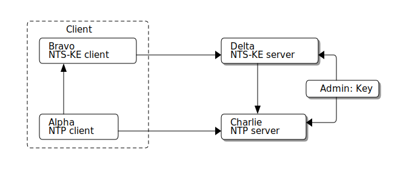

:draft-nts: https://tools.ietf.org/html/draft-ietf-ntp-using-nts-for-ntp
= NTS support specification

== Cisco's Statement of Work requirements

The NTS implementation shall:

* Use OpenSSL 1.1.1 for its crypto functions.

* Address RFC5705 Keying Material Exporting and AES_SIV (RFC5297) code
  support which may not be natively supported in OpenSSL.

* Comply with the standardized specification of link:{draft-nts}[NTS]

* Be interoperable with the other reference implementations in IETF hackathons.

== General Ideas

The NTP server maintains no per-client state.  The necessary state
is provided by a cookie that is included with each NTP request.  An
initial batch of cookies is provided by the NTS-KE server.  The
NTP client treats the cookies as opaque data and sends one to the
NTP server with each request.

A cookie contains the AEAD algorithm and keys necessary to
authenticate a request.  They are encrypted with the NTP servers
key.  The NTP server decrypts the cookie to retrieve the
encryption parameters (AEAD algorithm and keys) and then uses
them to authenticate the packet.  To issue a new cookie, the NTP
server makes a new nonce and uses the AEAD algorithm and keys
from the old cookie.

NTS should avoid exposing information that would be useful in
tracking the client.  (Consider a laptop that moves from home
to work to a coffee shop.)  Thus cookies should only be used once.
To implement that, each NTP response includes a new cookie, which is
encrypted when sent to the client.  (Otherwise, the cookie could be
observed in transit, which would allow for tracking the client when
it later echoes that cookie back to the server.)

NTS should not assist DDoS amplification.  All NTP responses
are the same length as the request.  This means that some
fields are padded to match the length of the response that
will replace them.

== System Partitioning

This picture is for discussion.  In actual packaging Alpha and Bravo
will both be inside ntpd. In the simple case, Charlie and Delta can
also be packaged together.  In complicated cases, Delta could serve multiple
Charlies, e.g. in a data-center deployment or for load sharing.

----
  ╔═══════════════════╗
  ║     Client        ║
  ║ ┌───────────────┐ ║           ┌───────────────┐
  ║ │ Bravo         │ ║           │ Delta         │
  ║ │ NTS-KE client ├─╫──────────►│ NTS-KE server │◄─┐
  ║ └───────────────┘ ║           └─────┬─────────┘  │
  ║     ▲             ║                 │            │
  ║     │             ║                 │       ┌────┴───────┐
  ║     │             ║                 │       │ Admin: Key │
  ║     │             ║                 │       └────┬───────┘
  ║     │             ║                 ▼            │
  ║ ┌───┴────────┐    ║           ┌─────────────┐    │
  ║ │ Alpha      │    ║           │ Charlie     │◄───┘
  ║ │ NTP client ├────╫──────────►│ NTP server  │
  ║ └────────────┘    ║           └─────────────┘
  ╚═══════════════════╝
----

In this diagram, an arrow means "initiates requests to".
Responses flow in the other direction.  Each connection
is used for one request/response transaction.

The NTS-KE server has to make cookies that the NTP server
will process.  There are 2 ways to do that.  First, they can share
the same key, new-cookie recipe, and new-key recipe.  If they are
in separate systems, the admin must set up the initial key and keep
the keys in sync if either system gets trashed.  The second way is
for the NTS-KE server to ask the NTP server for new cookies.  If it
does that, it doesn't need to know the key or anything about the
contents of a cookie.

=== Alpha -> Bravo
NTP client to NTS-KE client (Alpha to Bravo) is pretty simple.
As these will both be inside ntpd, this will be function calls,
not a network connection.

====  NTS-KE client sends:
-    Hostname of NTS-KE server
-    Optional preferred NTPD server hostname or IP Address
     link:{draft-nts}#section-4.1.7[4.1.7]
-    A sorted list of AEAD algorithms link:{draft-nts}#section-4.1.5[4.1.5]

====  NTS-KE server and NTS-KE client compute from the TLS connection:
-    C2S and S2C encryption keys link:{draft-nts}#section-4.2[4.2],
     link:{draft-nts}#section-5.1[5.1]

====  NTS-KE client gets back:
-    NTPD server hostname or IP Address link:{draft-nts}#section-4.1.7[4.1.7]
-    1 to 8 cookies link:{draft-nts}#section-4.1.6[4.1.6]
-    The selected AEAD algorithm link:{draft-nts}#section-4.1.5[4.1.5]

For AEAD, we need libaes_siv.so, RFC 5297
It's not in OpenSSL yet.
  https://github.com/dfoxfranke/libaes_siv

An NTP client SHOULD NOT initiate NTS-KE by default.  Configuration
parameters from the NTPD config file will tell the NTPD client when and
how to initiate NTS-KE.

While it is technically permitted (see RFC5280, page 35) to put an IP
address in a subjectAltName in a certificate, this is essentially never
done in practice, and rarely with public CAs.  Accordingly, the NTS-KE
client SHOULD NOT generally initiate NTS for servers specified by IP
address (whether IPv4 or IPv6).  The NTS-KE client MAY initiate NTS
for servers specified by IP address (whether IPv4 or IPv6) for testing
purposes.

Additionally, the NTP client SHOULD NOT initiate NTS for pool
associations by default.  The most common pool is the public pool at
pool.ntp.org.  The volunteer NTP servers will never be able to pass a
certificate check for <anything>.pool.ntp.org, so NTS-KE will always
fail, and represents a useless load on the public pool servers.  As the
pool statement can be used in other configurations that could work
with NTS-KE, the NTP client SHOULD allow NTS to be enabled on pool
associations.

The NTS-KE client SHOULD provide a configuration parameter to
configure the root CAs used to validate TLS certificates.

The NTS-KE client SHOULD have a configuration parameter to specify
which TLS protocols are permissible.  Regardless of what is
configured, because the NTS specification relies on RFC 5705, and
also because it explicitly says so, TLS 1.3 is the minimum TLS
version allowed.

The NTS-KE client SHOULD provide a configuration parameter to
configure an OpenSSL cipher string for the TLS connection.

The NTS-KE client SHOULD provide a configuration parameter to
configure an OpenSSL cipher string for the AEAD algorithms.

The NTP client SHOULD provide a mechanism for the administrator to
see whether NTS is currently in use on a given server association.

=== Bravo -> Delta
The NTS-KE client to NTS-KE server (Bravo to Delta) communication is
mostly the above in TLS 1.3 (or later) over TCP in the format
specified in the NTS draft.

The NTS-KE client (Bravo) and NTS-KE server (Delta) independently
derive the C2S and S2C keys.  For OpenSSL, this is implemented by
making two calls to SSL_export_keying_material(), which implements
RFC5705.  The label and context inputs are provided in
link:{draft-nts}#section-5.1[5.1].
This process is deterministic, so both ends generate the same C2S and S2C.

The NTS-KE client passes C2S and S2C to the NTP client.  The NTS-KE
server uses them to make the initial cookies.

The NTS-KE server then generates and returns 8 cookies using, for
example, the suggested format in section 6 of the NTS draft.  To do
so, the NTS-KE server needs a master key, called "K" in the draft.

=== Alpha -> Charlie
NTP client to NTP server (Alpha to Charlie)

If all goes well (no lost packets) the client sends:

-  The normal 48 byte NTP packet
-  A 32+ byte unique ID link:{draft-nts}#section-5.3[5.3]
-  A cookie link:{draft-nts}#section-5.4[5.4]
-  Authentication using C2S link:{draft-nts}#section-5.6[5.6]

It gets back the same, with the cookie replaced with a new cookie
and S2C used for authentication and to encrypt the new cookie.

The response is the same length.

All the extra data is in real NTP extensions.  (No more of
the magic length kludgery for the current shared key authentication.)

If packets (and hence cookies) are lost, the client will include
a cookie-placeholder for each extra cookie it wants.
link:{draft-nts}#section-5.5[5.5]
Those slots will be returned with new cookies.

The AEAD algorithm used for authentication is set up to encrypt some
data as well.  For the request, the encrypted data is empty.  For the
response, it contains a new cookie (or cookies). AEAD also needs a nonce;
see below for discussion and security concerns.

== Configuration

The NTS-KE server SHOULD have a configuration parameter to specify
which TLS protocols are permissible.  Regardless of what is
configured, because the NTS specification relies on RFC 5705, and
also because it explicitly says so, TLS 1.3 is the minimum TLS
version allowed.

The NTS-KE server SHOULD have a configuration parameter to specify its
preferred AEAD algorithms for the TLS connection in preference order.
This SHOULD be provided as an OpenSSL cipher string.

The NTS-KE server SHOULD have a configuration parameter to specify
its preferred AEAD algorithms for the NTPD connection in preference
order.  This SHOULD be provided as an OpenSSL cipher string.
AEAD_AES_SIV_CMAC_256 [RFC5297] MUST be supported[4.1.5].

The nonce situation has impacts on algorithm choice.  There are two ways
to generate a nonce: randomly or as a counter.  Given the hard
requirement that the server be stateless, the only place for the server
to store state is in the cookie.  Clients are allowed to reuse cookies,
so the server cannot use the cookie to store nonce state.  No matter what
state the server stores in the cookie, if the client replays a cookie,
the server would replay the nonce.

Unless the AEAD algorithm is specifically designed to be nonce-misuse
resistant, then reusing the nonce catastrophically breaks the security.
For example, the AES-GCM RFC [RFC5116] says, "
   The inadvertent reuse of the same nonce by two invocations of the GCM
   encryption operation, with the same key, but with distinct plaintext
   values, undermines the confidentiality of the plaintexts protected in
   those two invocations, and undermines all of the authenticity and
   integrity protection provided by that key.  For this reason, GCM
   should only be used whenever nonce uniqueness can be provided with
   assurance."

So we might as well generate the nonce randomly rather than jumping
through hoops to try to implement a counter-based nonce that will fail
anyway under cookie reuse.  A random nonce also prevents the client from
gaining some advantage by reusing the cookie maliciously.  But a
randomly-generated nonce also does not _guarantee_ that nonce reuse will
not happen.  Thus, absent contrary guidance from a cryptography expert,
the AEAD algorithm MUST be nonce-misuse resistant.  The only current AEAD
algorithms with this property are AEAD_AES_SIV_CMAC in 256, 384, and 512
variants and AEAD_AES_128_GCM_SIV in 128 and 256 variants.  This can be
verified by checking each AEAD algorithm's specification.

Honoring the NTS-KE client's AEAD preference order for the NTPD
connection is OPTIONAL[4.1.5].  The typical approach is to honor the
client's order by default (i.e. pick the first algorithm in the client's
list which is supported by the server), unless a configuration option has
been set on the server to reverse that (i.e. pick the first algorithm in
the server's list which is supported by the client).

The NTS-KE server SHOULD have a configuration parameter to specify
the TLS key, certificate, and intermediate certificate bundles.

The NTS-KE server MAY have a method to reload the key, certificate,
and intermediate certificate bundles without a full daemon restart.

== NTS Configuration parameters (client side)

Options now implemented in the config parser are now described in
docs/includes/auth-commands.txt

To avoid having to hand-configure TLS versions, the right (and
conformant) thing is to do is honor the global mintls and maxtls
options, then just use the most recent version at or above it your TLS
library and the remote both support. If the remote can't cope, you
abort.

To avoid having to hand-configure ciphers offered to the remote, we
can initially have a list of common known-good ones wired in.  Eventually,
this list should be configurable.  For the reasons discussed above in the
server section, the client's default list of ciphers SHOULD be restricted
to only those algorithms known to be nonce-misuse resistant.

== NTS-KE Server Configuration parameters

== TLS Options

The directory with the Certificates of Certification Authorities (CAs).

....
TLSCACertificatePath directory-path
....

A file with this NTS-KE servers certificate data in PEM format.  May
include chain certificates.

....
TLSCertificateFile file-path
....

The PEM-encoded private key file for the server.

....
TLSCertificateKeyFile file-path
....

A colon-separated cipher-spec string consisting of OpenSSL cipher
specifications to configure the Cipher Suite the client is permitted
to negotiate in the TLS handshake phase.

....
TLSCipherSuite TLS1.3 cipher-spec
....

A colon-separated cipher-spec string consisting of OpenSSL AEAD cipher
specifications to configure the cipher suite for the NTP traffic.

Therefore, the server MUST restrict the list of AEAD algorithms to only
those algorithms known to be nonce-misuse resistant.

For the reasons discussed above, the server MUST limit the accepted AEAD
algorithms in this to only those algorithms known to be nonce-misuse
resistant.  Maybe this should be downgraded to a SHOULD, because a new
nonce-misuse resistant algorithm could be added to OpenSSL and ntpd would
not know about it.  If it is possible to just pass a cipher string to
OpenSSL and let it filter the list of AEAD algorithms (as is possible with
TLS), that makes sense.  But if the NTS-KE server implementation has to
parse this list itself and switch-case on the value, then it would have to
be updated for new algorithms anyway, and it makes sense to leave this at
a MUST.

If no list is specified, the default list MUST include
AEAD_AES_SIV_CMAC_256.  However, if the user specifies a list, the server
MUST NOT add AEAD_AES_SIV_CMAC_256 to that list implicitly, as this would
preclude the user from disabling AEAD_AES_SIV_CMAC_256 in the future,
should that become necessary.

....
NTPCipherSuite cipher-spec
....

Option to prefer the server's cipher preference order for the TLS connection.
Default on.

....
TLSHonorCipherOrder on|off
....

Option to prefer the server's cipher preference order for the NTP packets.
Default on.

....
NTPHonorCipherOrder on|off
....

Which versions of the TLS protocol will be accepted in new TLS connections.

....
TLSProtocol [+TLS1.3]
....

Configures one or more sources for seeding the Pseudo Random Number
Generator (PRNG) in OpenSSL at startup time.  One source per directive.
Multiple directives may be used.  Source may be: builtin, "file:/dev/random",
"file:/dev/urandom", etc.

....
TLSRandomSeed source [bytes]
....

Sets the Certificate verification level for the Client Authentication.
The level may be: none: no client Certificate is required at all, optional:
the client may present a valid Certificate, require: the client has to
present a valid Certificate, optional_no_ca: the client may present a
valid Certificate but it need not be verifiable.

....
TLSVerifyClient level
....

== Key Generation and Usage

NTS makes use of three keys:

* Client to Server key (C2S)

* Server to Client key (S2C)

* NTS Master Key (called K in the NTS draft)

Because one of the goals of NTS is to not require any per-client
state in the servers, the servers (both NTP and NTS-KE) do not
store either of C2S/S2C.  Both servers possess the NTS Master Key,
which is expected to be updated somewhat regularly, with old versions
being kept for some time (SHOULD be two rotation cycles) to allow for
old cookies to be decrypted.

The C2S and S2C keys are derived from the TLS session data between
the NTS-KE client and the NTS-KE server using the RFC5705 algorithm.
These are not the same as the keys used by TLS to protect the data
flowing over the TLS connection itself.

As part of the setup, NTS-KE will create a variable number of cookies
(which SHOULD be 8).  These cookies are encrypted with the NTS Master
Key, and are opaque to the client. The cookies contain C2S and S2C in
a form that the NTP server will understand, and this is how the NTP
server is able to en/decrypt data without needing to store per-client
keys.

When sending an NTP packet, the client attaches a cookie blob in
cleartext, then authenticates the packet using the C2S key. When
the NTP server receives the packet, it decrypts the cookie using its
NTS Master Key to recover C2S and S2C.  It uses C2S to authenticate the
packet. For the response, S2C is used to encrypt the new cookies and
authenticate the return packet.

== Certificate Verification

To recap: In normal operation, the client MUST verify the NTS-KE
server's TLS certificate in the usual way, checking the certificate
chain and the hostname.  For testing or workaround purposes, a
`noval` or similar configuration option SHOULD be provided which
skips certificate validation.

It is desirable to include a middle-ground option, where the
certificate chain is validated, but certificate timestamps (`notBefore`
and `notAfter`) are ignored.  This would be useful to allow the client to
correct for a bogus system clock.  A specific subset of bogus system
clock scenarios is that the system lacks an RTC, or the RTC's battery
has died.  However, such a mode should be carefully constructed to
minimize the loss of security.  If such a mode is implemented, the client
MUST have a configuration option to enable/disable it.

One possible implementation is as follows.

If certificate validation is disabled entirely with the `noval` option,
pass `SSL_VERIFY_NONE` to `SSL_CTX_set_verify()` and do not register any
custom verification hook.  These peers will be treated as if certificate
verification succeeded, without any of the special "suspect" behavior
or `notBefore`/`notAfter` checks.

If the configuration option is set to strict security or if ntpd has
already set the system clock, let OpenSSL handle certificate verification
normally.  That is, do not register a custom verification callback.  This
way, the risk of any bugs in the custom certificate verification code is
contained to initial startup.  Otherwise, register a custom callback
with `SSL_CTX_set_cert_verify_callback()`, passing some state (e.g. a
`peer` object) as the `arg` parameter.  When the callback is called,
perform certificate verification (leveraging built-in OpenSSL
functionality to the extent possible!).  If the verification fails for a
reason other than certificate validity times, return failure.  If a
verification step fails due to certificate validity times, set a
`peer->suspect` flag, but otherwise continue.

As each certificate in the chain is inspected, save the _latest_
`notBefore` and _earliest_ `notAfter` into the peer object.  In other
words, if no value is saved (i.e. this is the first certificate), save
the certificate's values; otherwise save the certificate's `notBefore`
only if it is later than the existing `peer->notBefore` and save the
certificate's `notAfter` only if it is earlier than the existing
`peer->notAfter`.  If an OCSP stapled response is present, similarly
limit the peer's `notBefore` and `notAfter` values to the validity range
of the OCSP stapled response.

The objective of this is to limit the possible forged times that the
client will accept.  If the client is configured to require multiple
sources of time (e.g. `minsane 3`), an attacker trying to re-use
compromised expired certificates would need multiple such certificates
with overlapping validity, and would still only be able to get the
client to accept times within that period of overlap.  This helps limit
attacks.  If a certificate uses OCSP "must staple", the attacker needs to
replay OCSP responses too, which have much shorter validity periods (e.g.
7 days), significantly limiting this even further.

In the clock selection algorithm, very early on, add something like:

----
if (peer->suspect) {
    /* Suspect peers are ignored ("leave the island"), unless
     * <some condition>.
     */

    // <some condition> is something that indicates we would have
    // "normally" synced the clock by now.  My example was that
    // reach (as output by ntpq -p) was 377 (i.e. we had 8 successful
    // polls on that peer), or maybe allow for one missed? It probably
    // cannot be time passed because the network could be down for an
    // indeterminate length of time when ntpd comes up.

    if (!<some condition>)
        continue;
}
----

The idea here is that we spin up the suspect associations normally, but
we ignore them for "a while" which would normally be sufficient to set
the clock.  If there are enough other associations working, great, we
didn't use the suspect association(s) at all, so there was no loss in
security.  Only if we couldn't set the clock in a reasonable amount of
time or whatever would we then fall back to considering the suspect
associations.  But, because they have been running the whole time rather
than just starting now, we minimize the time to clock update when we do
need to use the suspect associations.

Once the clock is set the first time, kill all suspect associations
(including those used to set the time), forcing those peers to re-run
NTS-KE and start over.  They will either pass normally or fail normally.
Since the clock has now been set, only normal certificate validation will
be allowed moving forward.

Additionally, if the NTP server gives (authenticated) time earlier than
the `peer->notBefore` value (if set), discard that time or mark the peer
as a falseticker.  If the server gives valid time, set a flag in the peer
indicating that.  If the server gives time after the `notAfter` and the
peer's valid time flag is unset (the server has never given valid time),
discard that time or mark the peer as a falseticker.  These checks should
never trigger on legitimate traffic, as that would mean the NTP server
disagrees with its NTS-KE server's CA about time.
link:{draft-nts}#section-9.3[9.3]

It might be considered useful to always apply these
`notBefore`/`notAfter` sanity checks, not just for "suspect"
associations.  If that is the case, then the `peer->notBefore` and
`peer->notAfter` values will have to be set in all cases.  However, in
that event, it is still probably desirable to skip the custom certificate
verification code, so determining the `notBefore` and `notAfter` values
should be moved from the custom certificate verification callback to
happen after certificate validation.

== Odds and ends

How many cookies should the NTP client try to hold?  8

There is no hard reason, but it is what the NTS-KE server SHOULD return.
link:{draft-nts}#section-4.1.6[4.1.6]
It also matches the number of samples that ntpd remembers (the reach bit
mask in ntpq/peers) and running out of responses is a good time to do
special things like getting a new pool server or getting new cookies by running
NTS-KE again.

---

We need an exponential backoff when the NTS-KE step fails.

---

Note that the communication between NTS-KE client and NTP client
needs to be kept private.  (aka encrypted if it goes over the net)
Same for NTS-KE server and NTP server.
Both connections contain C2S and S2C keys.

---

Some interesting notes on OCSP stapling:
https://blog.cloudflare.com/high-reliability-ocsp-stapling/

Also, here are some notes about how to implement good OCSP stapling on
the server side:
https://gist.github.com/sleevi/5efe9ef98961ecfb4da8
linked from:
https://community.letsencrypt.org/t/ocsp-stapling-advantages-and-disadvantages/34465/11

== Potential cookie recipe(s)

. Form a plaintext "P" comprised of records
.. minimum of an AEAD algorithm record, c2s, and s2c key records
.. (optional) previously connected network address (for academic purposes)
.. (optional) a timestamp when to stop honoring the current cookie series
.. (optional) a timestamp when the current cookie series began (for expiration)
.. (optional) a Modified Julian Date when to stop honoring the current cookie series
.. (optional) a MJD when the current cookie series began (for expiration)
.. (optional) a number of cookies remaining before series expiration.
.. (optional) the number of cookies (estimated) since series began for expiration.
. encrypt it with the master key "K" (which has nothing to do w/ TLS)
. form the cookie w/ records for the master key number "I", an unsized nonce "N", and the ciphertext "C".

----
base	29	NThkZGExNTYxZGY3YWQzMTkxOGI4OTQ0ZWQ5YTU3MTc=	ZGZmZTg0MTBhZjk2YTgxOGE2ZDMwOGQ0Nzg0ZGMxNzg
track	192.168.1.107
btai	3753708891
etai	3761747291
bmjd	58460
emjd	58557
cdown	3460
cup	4210
----

An overly complicated example plaintext. records are carriage return terminated and fields are horizontal tab separated.
The example is set in January of 2019 for a chain starting mid-December and ending mid-March.
It is likely that only one of the expiry fields is desirable.
The cookie count up/down counter should change by the number of cookies issued (8).
The c2s/s2c fields should be base64 encoded.

----
27391	MjI4MGVlYWY2ZWMzOGZjNmQ4MmFjMjhmMGViYzYxZTQ=	U2FsdGVkX1/dO8WX4e+daOzR2dcRvbHOUv3jAMT51NttWrK+CnBUDWuhm54Hz31TG1P+VkWlrMGHAIHea9gQ3+shZj+I8pdPLrEn9V/E+1VJMC96qBo+x55yQmOyRLEJJSJMs25dSQ0idndKAOYqUOyulwruTe7QuPr+L5fVB9qSw2n18w/6BtnXsivAEjMpfxP9X7ZDZ46LHm1ayAcmMoccdjuwKqgPaa2ez33rlruXmcsF5omlguBZWxjm/iNZ
----

A wholly made up example cookie.

== Unresolved issues for the next RFC WG

The binary KE request-response format is unfortunate for all the usual
reasons (endianness issues etc). At the expected transaction volume,
the encode/decode overhead shouldn't be an issue.

How to make NTS-KE work, securely, with pooled servers?

link:{draft-nts}#section-4.1.3[4.1.3], link:{draft-nts}#section-4.1.4[4.1.4]

Is the response in case of abuse 'continue the abuse, just wait a minute'?

link:{draft-nts}#section-5.7[5.7]

Does the unique identifier extension need to be omniversally unique?

Why are the timestamps, unique identifier extension etc. seemingly not tamper resisted?

Can NTSN and other KODs get signed?

== NTS/mode 7 next

=== NTS and mode 6 and 7

Network Time Security explicitly only supports modes 3 and 4 at this time.
I see no reason why NTS could not be expanded to cover modes 1, 2, 6, and 7.
Expansion to cover modes 6&7 should require an authentication token extension.

More discussion of how to re-do Mode 6 has been moved to ntpv5.adoc.

// end
