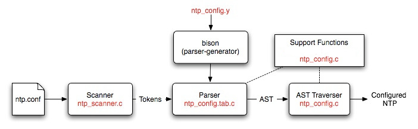

= Configuration File Definition (Advanced) =
include::html.include[]

[cols="10%,90%",frame="none",grid="none",style="verse"]
|==============================
|image:pic/pogo7.gif[]|
{millshome}pictures.html[from 'Pogo', Walt Kelly]

Racoon is shooting configuration bugs.

|==============================

== Table of Contents ==

* link:#synopsis[Synopsis]
* link:#files[Files]
* link:#high-level[High-Level Description]
* link:#detailed[Detailed Description]
* link:#guidelines[Guidelines for Adding Configuration Commands]

'''''

[[synopsis]]
== Synopsis ==

The NTP configuration process is driven by a phrase-structure grammar
which is used to specify the format of the configuration commands and
the actions needed to build an abstract syntax tree (AST). The grammar
is fed to a parser generator (Bison) which produces a parser for the
configuration file.

The generated parser is used to parse an NTP configuration file and
check it for syntax and semantic errors. The result of the parse is an
AST, which contains a representation of the various commands and
options. This AST is then traversed to set up the NTP daemon to the
correct configuration.

This document is intended for developers who wish to modify the
configuration code and/or add configuration commands and options. It
contains a description of the files used in the configuration process as
well as guidelines on how to construct them.

[[files]]
== Files ==

A brief description of the files used by the configuration code is given
below:

[cols="<40%,<60%",options="header"]
|==============================================================================
| File                    |     Description
| *ntp_config.y*          | This file is a Bison source file that contains the phrase-structure grammar and the actions that need to be performed to generate an AST.
|*ntp_config.c*           | This file contains the major chunk of the configuration code. It contains all the functions that are called for building the AST as well as the functions that are needed for traversing the AST.
| *ntp_config.h*          | This file is the header file for *ntp_config.c*. It mainly contains the structure definitions needed to build the AST.
| *ntp_scanner.c*         | This file contains the code for a simple lexical analyzer. This file is directly included into the *ntp_config.c* file since this code is only used by the configuration code. The most important function in this file is +yylex+, which is called by the generated parser to get the next token on the input line.
| *ntp_config.tab.c*      | This file is generated by Bison from the *ntp_config.y* file. This file is also included directly into the configuration code.
|==============================================================================

[[high-level]]
== High-Level Description ==

A high-level description of the configuration process showing where all
the files fit in is given below:

The scanner reads in an NTP configuration file and converts it into
tokens. The Bison generated parser reads these tokens and converts them
into an AST. The AST traverser consists of a set of functions that
configure parts of NTP on the basis of what is on the tree. A more
detailed description of these parts and the files used is given below:

[[detailed]]
== Detailed Description ==

*ntp_scanner.c*::
  This file contains the scanner. The scanner is a small program that
  converts an input NTP configuration file into a set of *tokens* that
  correspond to *lexemes* in the input. Lexemes are strings in the
  input, delimited by whitespace and/or special characters. Tokens are
  basically unique integers that represent these lexemes. A different
  token is generated for each reserved word and special character in the
  input. There are two main functions in the public interface of this
  file:
+int yylex+()::
  This function is called +yylex+ for historical reasons; +lex+ is a
  program that takes a set of regular expressions and generates a
  scanner that returns tokens corresponding to those regular
  expressions. The name of the generated function is called +yylex+. We
  aren't using +lex+ because it requires linking against an
  external library and we didn't want to increase the compile-time
  requirements of NTP.
+
History lessons aside, this function basically checks to see if the
next input character is a special character as defined in the array
+char special_char[]+. (The function +int is_special(char ch)+, can be
used for this.) If yes, the special character is returned as the
token. If not, a set of characters is read until the next whitespace
or special character is encountered. This set of characters forms the
lexeme; +yylex+ then checks whether this lexeme is an integer, a
double, an IP address or a reserved word. If yes, the corresponding
token is returned. If not, a token for a string is returned as the
default token.
+
+struct state *create_keyword_scanner(struct key_tok *keyword_list)+::
  This function takes a list of (_keyword, token_) pairs and converts
  them into a tree that can recognize the keywords (reserved words).
  Every time the scanner reads a lexeme, it compares it against the list
  of reserved words. If it finds a match, it returns the corresponding
  token for that keyword.

*ntp_config.y*::
  This file is structured as a standard Bison file and consists of three
  main parts, separated by +%%+:

1.  The prologue and bison declarations: This section contains a list of
the terminal symbols, the non-terminal symbols and the types of these
symbols.
2.  The rules section: This section contains a description of the actual
phrase-structure rules that are used to parse the configuration
commands. Each rule consists of a left-hand side (LHS), a right-hand
side (RHS) and an optional action. As is standard with phrase-structure
grammars, the LHS consists of a single non-terminal symbol. The RHS can
contain both terminal and non-terminal symbols, while the optional
action can consist of any arbitrary C code.
3.  The epilogue: This section is left empty on purpose. It is
traditionally used to code the support functions needed to build the
ASTs. Since we have moved all the support functions to *ntp_config.c*,
this section is left empty.

== Prologue and Bison Declarations ==

All the terminal symbols (also known as tokens) have to be declared in
the prologue section. Note that terminals and non-terminals may have
values associated with them and these values have types. (More on this
later). An unnamed union has to be declared with all the possible types
at the start of the prologue section. For example, we declare the
following union at the start of the *ntp_config.y* file:

-----------------------
%union {
    char *String;
    double Double;
    int Integer;
    void *VoidPtr;
    queue *Queue;
    struct attr_val *Attr_val;
    struct address_node *Address_node;
    struct setvar_node *Set_var;
    /* Simulation types */
    server_info *Sim_server;
    script_info *Sim_script;
}
-----------------------

Some tokens may not have any types. For example, tokens that
correspond to reserved words do not usually have types as they simply
indicate that a reserved word has been read in the input file. Such
tokens have to be declared as follows:

-----------------------
%token T_Discard
%token T_Dispersion
--------------------

Other tokens do have types. For example, a +T_Double+ token is returned
by the scanner whenever it sees a floating-point double in the
configuration file. The value associated with the token is the actual
number that was read in the configuration file and its type (after
conversion) is double. Hence, the token +T_Double+ will have to be
declared as follows in the prologue of *ntp_config.y* file:

-----------------------
%token <Double> T_Double
-----------------------

Note that the declaration given in the angled brackets is not +double+
but +Double+, which is the name of the variable given in the +%union {}+
declaration above.

Finally, non-terminal symbols may also have values associated with them,
which have types. This is because Bison allows non-terminal symbols to
have actions associated with them. Actions may be thought of as small
functions which get executed whenever the RHS of a non-terminal is
detected. The return values of these functions are the values associated
with the non-terminals. The types of the non-terminals are specified
with a +%type+ declaration as shown below:

-----------------------
%type <Queue> address_list
%type <Integer> boolean
-----------------------

The +%type+ declaration may be omitted for non-terminals that do not
return any value and do not have type information associated with them.

== The Rules Section ==

The rule section only consists of phrase-structure grammar rules. Each
rule typically has the following format:

-----------------------
LHS : RHS [{ Actions }]
    ;
-----------------------

where LHS consists of a single non-terminal symbol and the RHS consists
of one or more terminal and non-terminal symbols. The +Actions+ are
optional and may consist of any number of arbitrary C statements. Note
that Bison can only process LALR(1) grammars, which imposes additional
restrictions on the kind of rules that can be specified. Examples of
rules are shown below:

-----------------------
orphan_mode_command
     : T_Tos tos_option_list
        { append_queue(my_config.orphan_cmds, $2); }
     ;

tos_option_list
     : tos_option_list tos_option { $$ = enqueue($1, $2); }
     | tos_option { $$ = enqueue_in_new_queue($1); }
     ;
-----------------------

The +$n+ notation, where +n+ is an integer, is used to refer to the
value of a terminal or non-terminal symbol. All terminals and
non-terminal symbols within a particular rule are numbered (starting
from 1) according to the order in which they appear within the RHS of a
rule. +$$+ is used to refer to the value of the LHS terminal symbol - it
is used to return a value for the non-terminal symbol specified in the
LHS of the rule.

== Invoking Bison ==

Bison needs to be invoked in order to convert the *ntp_config.y* file
into a C source file. To invoke Bison, simply enter the command:

-----------------------
bison ntp_config.y
-----------------------

at the command prompt. If no errors are detected, an *ntp_config.tab.c*
file will be generated by default. This generated file can be directly
included into the *ntp_config.c* file.

If Bison report shift-reduce errors or reduce-reduce errors, it means
that the grammar specified using the rules in not LALR(1). To debug such
a grammar, invoke Bison with a +-v+ switch, as shown below. This will
generate a *ntp_config.output* file, which will contain a description of
the generated state machine, together with a list of states that have
shift-reduce/reduce-reduce conflicts. You can then change the rules to
remove such conflicts.

-----------------------
bison -v ntp_config.y
-----------------------

For more information, refer to the
http://www.gnu.org/software/bison/manual/[Bison manual].

*ntp_config.c*

This file contains the major chunk of the configuration code including
all the support functions needed for building and traversing the ASTs.
As such, most of the functions in this file can be divided into two
groups:

1.  Functions that have a +create_+ prefix. These functions are used to
build a node of the AST.
2.  Functions that have a +config_+ prefix. These functions are used to
traverse the AST and configure NTP according to the nodes present on the
tree.

[[guidelines]]
== Guidelines for Adding Configuration Commands ==

The following steps may be used to add a new configuration command to
the NTP reference implementation:

1.  Write phrase-structure grammar rules for the syntax of the new
command. Add these rules to the rules section of the *ntp_config.y*
file.
2.  Write the action to be performed on recognizing the rules. These
actions will be used to build the AST.
3.  If new reserved words are needed, add these to the
+struct key_tok ntp_keywords[]+ structure in the *keyword-gen.c* file.
This will allow the scanner to recognize these reserved words and
generate the desired tokens on recognizing them.
4.  Specify the types of all the terminals and non-terminal symbols in
the prologue section of the *ntp_config.c* file.
5.  Write a function with a +config_+ prefix that will be executed for
this new command. Make sure this function is called in the
+config_ntpd()+ function.

'''''

mailto:skamboj@udel.edu[Sachin Kamboj]

include::includes/footer.adoc[]
