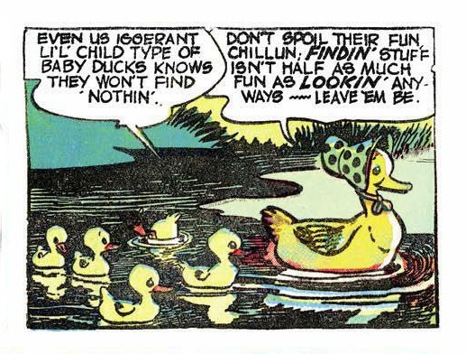

= ntpmon - real-time NTP status monitor =
include::html.include[]

[cols="10%,90%",frame="none",grid="none",style="verse"]
|==============================
||
{millshome}pictures.html[from 'Pogo', Walt Kelly]

Words of wisdom.

|==============================

== Manual Pages ==

include::includes/manual.adoc[]

'''''
== Table of Contents ==

* link:#_synopsis[Synopsis]
* link:#_description[Description]
* link:#_commands[Commands]
* link:#_options[Options]
* link:#_known_bugs[Known Bugs]
* link:#_mode_6_protocol[Mode 6 Protocol]

include::includes/ntpmon-body.adoc[]

== Mode 6 Protocol ==

The Mode 6 protocol used by ntpmon to communicate with {ntpdman}
is described link:mode6.html[here].

'''''

include::includes/footer.adoc[]
